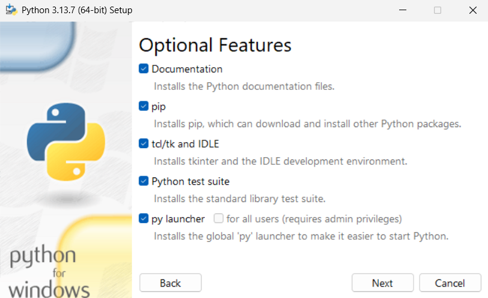
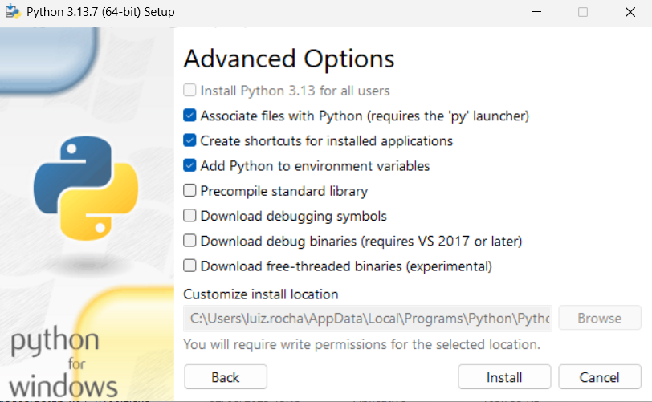

# Pacifica Trading Bot

Bot de **grid trading** e **scalping multi-asset** para a corretora **Pacifica** com **4 estratégias avançadas**: **Pure Grid** (clássica), **Market-Making Grid** (dinâmica), **Multi-Asset Básico** (scalping threshold) e **🧠 Multi-Asset Enhanced** (algoritmo inteligente com 5 indicadores técnicos).

Inclui gerenciamento de risco, métricas de performance, logs específicos por estratégia, sistema AUTO_CLOSE e validação automática.

> **⚠️ ATENÇÃO: RISCO ELEVADO**

O trading de contratos perpétuos com alavancagem envolve **altos riscos financeiros**, podendo resultar na perda total do capital investido. Este bot é fornecido **"no estado em que se encontra"**, sem garantias de desempenho, precisão ou lucratividade.

### Recomendações Importantes
- **Teste extensivamente**: Antes de usar o bot em um ambiente real, realize testes completos com valores baixos em uma conta de demonstração ou com capital que você está disposto a perder.
- **Use com cautela**: Bots automatizados podem amplificar erros ou reagir de forma inesperada em mercados voláteis.
- **Eduque-se**: Compreenda completamente os riscos do trading alavancado antes de utilizar este software.
- **Gerencie riscos**: Nunca invista mais do que você pode perder. Configure limites rigorosos de perda e monitore o bot regularmente.

**O desenvolvedor não se responsabiliza por perdas financeiras ou danos decorrentes do uso deste bot. Use por sua conta e risco.**

Leia o arquivo [DISCLAIMER](DISCLAIMER.md).


---

## 🚀 Principais Funcionalidades

### 📊 4 Estratégias de Trading Avançadas
- **Pure Grid (pure_grid)**: Grid trading clássico com ordens de compra/venda distribuídas em níveis de preço fixos
- **Market-Making Grid (market_making)**: Grid dinâmico que se adapta à volatilidade e spread do mercado  
- **Multi-Asset Básico (multi_asset)**: Scalping threshold com comparação de 3 preços (atual + 2 anteriores)
- **🧠 Multi-Asset Enhanced (multi_asset_enhanced)**: Algoritmo inteligente com 5 indicadores técnicos:
  - **Momentum** (30 pontos): Análise de força do movimento
  - **Trend** (25 pontos): Direção da tendência SMA
  - **RSI** (20 pontos): Índice de força relativa
  - **Volatility** (15 pontos): Análise de volatilidade ATR
  - **Confirmation** (10 pontos): Confirmação de sinal

### 🎯 Sistema de Gerenciamento de Risco
- **Take Profit (TP)** e **Stop Loss (SL)** configuráveis por estratégia
- **Sistema AUTO_CLOSE híbrido**: Combina tempo de vida + condições de mercado
- **Validação automática** de saldos e posições abertas
- **Controle de alavancagem** por ativo

### 📈 Métricas e Monitoramento
- **Performance tracking** em tempo real com ROI, Sharpe Ratio e drawdown
- **Logs específicos por estratégia** com emojis e terminologia adequada
- **Sistema de notificação** de operações e eventos críticos
- **Relatórios detalhados** de trades e resultados

### ⚙️ Configuração Simplificada
- **STRATEGY_TYPE único**: Seleção simples entre as 4 estratégias
- **Configuração .env** com exemplos para cada estratégia
- **Templates prontos** para diferentes cenários de trading

### 🛠️ Recursos Técnicos
- Rebalanceamento automático e deslocamento de grid por limiar
- **Multi-Asset Trading** com gerenciamento individual de risco por símbolo
- Gestão de margem, limite de ordens e tamanho máximo de posição
- **Sistema AUTO_CLOSE** com estratégia híbrida para proteção automática de risco
- **Loss Management** especializado para cenários de alta volatilidade
- Logs estruturados (arquivo e console) e *shutdown* gracioso
- **PerformanceTracker** com métricas como *win rate*, *drawdown*, *Sharpe/Sortino*, *profit factor*
- Arquivo `.env` com configuração declarativa

## 🧱 Arquitetura (alto nível)

### 🏗️ Estrutura Principal
```
grid_bot.py                          # Orquestração principal e seleção de estratégia
src/
├── pacifica_auth.py                 # Cliente de API (REST/WebSocket) da Pacifica
├── grid_calculator.py               # Cálculo de níveis do grid e tamanhos
├── grid_strategy.py                 # Estratégia Pure Grid / Market-Making Grid
├── multi_asset_strategy.py          # Estratégia Multi-Asset Básico
├── multi_asset_enhanced_strategy.py # 🧠 Estratégia Enhanced com 5 indicadores
├── enhanced_signal_detector.py      # Detector de sinais com algoritmo avançado
├── strategy_logger.py               # Sistema de logs específicos por estratégia
├── position_manager.py              # Saldo, margem, ordens e posições
└── performance_tracker.py           # Métricas e relatórios de performance
```


## 🚀 Instalação

### 1) Pré-requisitos
a. Python 3.10+ (recomendado 3.12) 

. Baixe o instalador no [site oficial](https://www.python.org/downloads/).

. Durante a instalação na primeira tela, selecione todas as opções



. Na próxima tela, marque **Add Python to PATH**:



Anote o caminho informado em customize install location ou altere para um caminho mais facil como c:\python3

. Next, Next, Next até o final

. Testar a instalação do python. Abra o Prompt de Comando, Powershell ou Terminal e digite:

```
  python --version
  pip --version
```

Se aparecer a versão está ok ✅

* se não mostrar a versão é porque o PATH ainda não está ativado e precisa de um reboot. Se quiser testar sem o reboot, digite o comando com o caminho completo (exemplo c:\python3\python.exe --version)

b `git` instalado (opcional)

. Baixe em git-scm.com/download/win

. Execute o instalador → Next, Next, Next até o final, só confira estas opções:

    Git from the command line and also from 3rd-party software (adiciona o Git ao PATH).

    Enable Git Credential Manager (facilita login no GitHub, pode deixar marcado).

    O resto pode deixar padrão.

c. Teste no Prompt, Powershell ou Terminal:

```
git --version
```

Se aparecer a versão está ok ✅

### 2) Clonar o repositório (necessário git) ou fazer download

Opção 1) Entrar no repositório, clicar em Code e selecionar a opção download ZIP. Extraia o arquivo ZIP em uma pasta que será usada para a execução do Bot (anote o caminho desta pasta). 

Opção 2) Crie manualmente uma pasta e entre no powershell ou terminal e caminhe até a pasta. Depois execute: 

```bash
git clone https://github.com/lzrbraeth-afk/pacifica-grid-bot.git
cd pacifica-grid-bot
```

### 3) Ambiente virtual

Abra o powershell ou terminal, navegue até a pasta onde está o bot e confirme que os arquivos estão aparecendo. Na lista tem que aparecer principalmente grid_bot.py, .env.example e a pasta src.

Digite um comando de cada vez no **Windows (PowerShell) ou Terminal:**
```
py -3 -m venv .venv
.\.venv\Scripts\Activate.ps1
python -m pip install --upgrade pip
pip install -r requirements.txt
```

Ou se estiver usando **Linux/macOS:**
```bash
python3 -m venv .venv
source .venv/bin/activate
python -m pip install --upgrade pip
pip install -r requirements.txt
```

### 4) Gerar chave API na corretora

Na corretora entre na página API KEY (https://app.pacifica.fi/apikey), clique em generate e copie o codigo que vai surgir e cole no campo AGENT_PRIVATE_KEY_B58 do arquivo .env (etapa descrita abaixo). Por enquanto pode só copiar esta chave e depois clicar em create para que a chave seja aprovada com sua carteira. Depois de autorizado pode seguir para o próximo passo. 

### 5) Configuração (.env)

Renomeie o arquivo de exemplo e edite os valores. A melhor forma de fazer isto é ir no windows explorer e renomear o arquivo de .env.example para .env

Lembre-se de manter o nome com o ponto no inicio. Depois abra o arquivo e edite-o no notepad ou qualquer outro editor de texto.

Edite **MAIN_PUBLIC_KEY** e **AGENT_PRIVATE_KEY_B58** e demais parâmetros conforme sua preferência (ver seção Configuração).

No campo MAIN_PUBLIC_KEY você inclui o endereço publico da sua carteira usada na corretora e no campo AGENT_PRIVATE_KEY_B58 vai colar a chave API que vai ser gerada na corretora, conforme orientação anterior. 

## ▶️ Como executar

Na raiz da pasta do bot, a mesma que tem o arquivo .env, digite o comando: 

```bash
python grid_bot.py
```

Para encerrar com segurança: `Ctrl + C` (o bot finaliza e imprime um resumo).


# 🔄 Atualização do Bot Pacifica

O processo de atualização foi simplificado para ser feito em poucos passos, tanto no **Windows** quanto no **Linux/Mac**.

---

## 🟦 Windows

1. Na pasta do **Bot Pacifica**, clique duas vezes no arquivo **`update.bat`**.  
2. Escolha a opção desejada:  
   - `1` → **Nova instalação** (baixa tudo do zero).  
   - `2` → **Atualização** (move seu `.env` para `.env.old`).  
3. Após a atualização (opção 2):  
   - Abra o arquivo `.env.old` → copie sua **API KEY** e demais dados.  
   - Renomeie o novo arquivo **`.env.example`** para **`.env`**.  
   - Cole dentro dele as informações copiadas.  

✅ Seu bot está atualizado e configurado.

---

## 🟩 Linux/Mac

1. No terminal, dentro da pasta do **Bot Pacifica**, rode:  
   ```bash
   chmod +x update.sh
   ./update.sh
```

## ⚙️ Configuração (.env)

### 🎯 Seleção de Estratégia Simplificada

O bot agora usa um **sistema simplificado** com uma única variável `STRATEGY_TYPE`:

```ini
# ✅ ESTRATÉGIA (Escolha UMA das 4 opções)
STRATEGY_TYPE=pure_grid           # Grid trading clássico
# STRATEGY_TYPE=market_making     # Grid dinâmico adaptativo
# STRATEGY_TYPE=multi_asset       # Scalping multi-asset básico
# STRATEGY_TYPE=multi_asset_enhanced  # 🧠 Enhanced com 5 indicadores
```

### 📋 Configuração Base

```ini
# 🔐 API / Segurança
MAIN_PUBLIC_KEY=                    # Seu endereço da carteira SOL
AGENT_PRIVATE_KEY_B58=              # Chave privada gerada durante criação da API
API_ADDRESS=https://api.pacifica.fi/api/v1
WS_BASE_URL=wss://ws.pacifica.fi/ws

# 💰 Ativo e Alavancagem  
SYMBOL=SOL                          # Ativo principal (Pure Grid/Market Making)
LEVERAGE=10                         # Alavancagem padrão

# 🎯 Estratégia Selecionada
STRATEGY_TYPE=multi_asset_enhanced  # Escolha sua estratégia

# 🌐 Multi-Asset Trading (para multi_asset e multi_asset_enhanced)
SYMBOLS=BTC,ETH,SOL,AVAX           # ou AUTO para todos os símbolos
POSITION_SIZE_USD=20               # Tamanho da posição em USD
MAX_CONCURRENT_TRADES=3            # Máximo de trades simultâneos
PRICE_CHANGE_THRESHOLD=0.3         # Threshold de mudança de preço (%)

# 🛡️ Take Profit / Stop Loss
AUTO_CLOSE_ENABLED=true            # Habilitar sistema AUTO_CLOSE
STOP_LOSS_PERCENT=2.0             # Stop Loss em %
TAKE_PROFIT_PERCENT=1.5           # Take Profit em %
USE_API_TP_SL=true                # Usar TP/SL via API (recomendado)
TRAILING_STOP_ENABLED=false       # Trailing stop
TRAILING_STOP_PERCENT=0.5         # Trailing stop %
MAX_POSITION_TIME_MINUTES=60

# Grid (básico)
GRID_LEVELS=8
GRID_SPACING_PERCENT=0.2
GRID_DISTRIBUTION=symmetric
GRID_MODE=maker

# Risco e Auto-Close
MARGIN_SAFETY_PERCENT=20
MAX_OPEN_ORDERS=20
MAX_POSITION_SIZE_USD=1000

# Sistema AUTO_CLOSE (Proteção Automática)
AUTO_CLOSE_ON_MAX_POSITION=true
AUTO_CLOSE_STRATEGY=hybrid  # hybrid|cancel_orders|force_sell|stop_buy
AUTO_CLOSE_PERCENTAGE=20

# Operação
CHECK_BALANCE_BEFORE_ORDER=true
CLEAN_ORDERS_ON_START=false
LOG_LEVEL=INFO
REBALANCE_INTERVAL_SECONDS=60
```

> **Dica**: Comece conservador (menos níveis, maior espaçamento, ordem menor) e aumente aos poucos.

## Video com passo a passo para instalar o BOT, depois de instalado o PYTHON 

<https://www.youtube.com/watch?v=cKypCQwXctc>

## 🎯 Estratégias Disponíveis

### 🧠 Multi-Asset Enhanced (Recomendada)
**Algoritmo inteligente** com 5 indicadores técnicos e sistema de scoring 0-100:

```ini
STRATEGY_TYPE=multi_asset_enhanced
SYMBOLS=BTC,ETH,SOL,AVAX           # Símbolos para análise
POSITION_SIZE_USD=20               # Tamanho por posição
MAX_CONCURRENT_TRADES=3            # Trades simultâneos
ENHANCED_MIN_SCORE=60              # Score mínimo (0-100)
ENHANCED_CONFIDENCE_THRESHOLD=0.7  # Confiança mínima
```

**Indicadores e Pesos:**
- 🚀 **Momentum** (30pts): Força do movimento de preço
- 📈 **Trend** (25pts): Direção da tendência (SMA 20/50)
- ⚡ **RSI** (20pts): Sobrecompra/sobrevenda
- 🌊 **Volatility** (15pts): Análise ATR para timing
- ✅ **Confirmation** (10pts): Confirmação do sinal

**Vantagens:**
- Análise técnica avançada com múltiplos indicadores
- Sistema de scoring inteligente (0-100)
- Adaptação automática às condições de mercado
- Redução significativa de falsos sinais

### 🌐 Multi-Asset Básico
Trading simultâneo com análise threshold simples:

```ini
STRATEGY_TYPE=multi_asset
SYMBOLS=BTC,ETH,SOL,AVAX     # Símbolos específicos
# ou SYMBOLS=AUTO            # Busca todos disponíveis

POSITION_SIZE_USD=20         # Tamanho individual por ativo  
MAX_CONCURRENT_TRADES=3      # Máximo de posições simultâneas
PRICE_CHANGE_THRESHOLD=0.3   # % mínima para entrada
```

**Vantagens:**
- Diversificação automática de risco
- Gerenciamento independente por símbolo  
- AUTO_CLOSE individual por posição
- Configuração simples e rápida

### ⚡ Pure Grid (Clássica)
Grid tradicional com range fixo de preços:

```ini
STRATEGY_TYPE=pure_grid
RANGE_MIN=48000             # Preço mínimo do range
RANGE_MAX=52000             # Preço máximo do range
GRID_LEVELS=20              # Número de níveis
```

### 🔄 Market Making Grid (Dinâmica)
Grid que se adapta ao movimento do preço:

```ini  
STRATEGY_TYPE=market_making
GRID_SHIFT_THRESHOLD_PERCENT=1.0  # % para rebalanceamento
REBALANCE_INTERVAL_SECONDS=60     # Intervalo de verificação
```

## � Sistema de Logs Específicos por Estratégia

O bot possui um **sistema avançado de logs** que adapta mensagens, emojis e terminologia de acordo com a estratégia selecionada:

### 🎨 Personalização por Estratégia

**Pure Grid** 📊
```
📊 [GRID] Configurando grid: 20 níveis entre $48000-$52000
📊 [GRID] Ordem de compra colocada no nível $49500
```

**Market Making** 🔄  
```
🔄 [MARKET_MAKING] Grid rebalanceado: novo centro $51200
🔄 [MARKET_MAKING] Spread adaptado à volatilidade: 0.8%
```

**Multi-Asset Básico** 🌐
```
🌐 [MULTI_ASSET] Analisando 4 ativos: BTC, ETH, SOL, AVAX
🌐 [MULTI_ASSET] SOL: mudança de 2.3% detectada - Executando entrada
```

**Multi-Asset Enhanced** 🧠
```
🧠 [ENHANCED] Score BTC: 75/100 (Momentum:25, Trend:20, RSI:15, Vol:10, Conf:5)
🧠 [ENHANCED] Sinal COMPRA confirmado - Confiança: 82%
```

### �📊 Métricas e Logs

- **Logs específicos**: Salvos em `logs/` com timestamp (ex.: `grid_bot_YYYYMMDD_HHMMSS.log`)
- **Relatórios de performance**: Win rate, drawdown, Sharpe Ratio atualizados em tempo real
- **Filtros automáticos**: Mensagens relevantes para cada estratégia
- **Emojis identificadores**: Facilita identificação visual nos logs

## 🛡️ Sistema AUTO_CLOSE (Proteção Automática)

O bot inclui um sistema de **proteção automática** que monitora o tamanho da posição e **executa ordens reais** de emergência quando necessário:

> ⚠️ **IMPORTANTE**: AUTO_CLOSE executa **ordens reais** na API (não apenas logs)

### ⚙️ Configuração AUTO_CLOSE

```ini
AUTO_CLOSE_ON_MAX_POSITION=true     # Ativa proteção automática
AUTO_CLOSE_STRATEGY=hybrid          # Estratégia: hybrid|cancel_orders|force_sell|stop_buy
AUTO_CLOSE_PERCENTAGE=20            # % da posição a vender em emergência
MAX_POSITION_SIZE_USD=1000          # Limite máximo da posição em USD
```

### 🎯 Como Funciona

1. **Monitoramento Contínuo**: Calcula `posição = margin_used × leverage`
2. **Detecção**: Se posição > `MAX_POSITION_SIZE_USD`, ativa AUTO_CLOSE
3. **Execução Real**: Cancela/cria ordens via API Pacifica
4. **Estratégia HYBRID** (recomendada):
   - **Step 1**: Cancela ordens SELL distantes (>2% do preço atual)
   - **Step 2**: Se insuficiente, vende `AUTO_CLOSE_PERCENTAGE`% da posição

### 📋 Estratégias Disponíveis

- `hybrid`: Cancela ordens primeiro, depois vende parcialmente (recomendado)
- `cancel_orders`: Apenas cancela ordens distantes  
- `force_sell`: Vende percentual da posição imediatamente
- `stop_buy`: **Loss Management** - cancela apenas ordens de compra

### 🔴 Loss Management (stop_buy)

Estratégia especializada para cenários de alta volatilidade:
- Cancela **apenas ordens de COMPRA**
- **Mantém posição atual** (não vende)
- Evita acúmulo durante quedas de mercado
- Útil quando se espera recuperação


## 🧪 Troubleshooting e Validação

### Interpretação dos Resultados

**✅ Sistema Funcionando:**
```
🎯 SCORE DE VALIDAÇÃO: 6/6  
🎉 SISTEMA AUTO_CLOSE HYBRID TOTALMENTE FUNCIONAL!
```

**❌ Problemas Comuns:**

| Erro | Causa Provável | Solução |
|------|----------------|---------|
| Score < 6/6 | Configuração .env incorreta | Verificar variáveis AUTO_CLOSE |
| API Error 401 | Chave privada inválida | Regenerar AGENT_PRIVATE_KEY_B58 |
| "Estratégia desconhecida" | Nome incorreto | Usar: hybrid, cancel_orders, force_sell, stop_buy |
| "Posição não calculada" | Sem posições ativas | Normal se não estiver tradando |

### Troubleshooting Rápido

- **Bot não inicia**: Verifique `.env` - MAIN_PUBLIC_KEY e AGENT_PRIVATE_KEY_B58
- **Ordens não executam**: Cheque margem disponível e configuração de símbolos
- **AUTO_CLOSE não ativa**: Verifique se AUTO_CLOSE_ENABLED=true
- **Multi-asset básico não funciona**: Confirme SYMBOLS válidos e STRATEGY_TYPE=multi_asset
- **Enhanced Strategy com score baixo**: Ajuste ENHANCED_MIN_SCORE (padrão: 60)
- **Poucos sinais Enhanced**: Diminua ENHANCED_CONFIDENCE_THRESHOLD (padrão: 0.7)
- **Logs não aparecem**: Verifique se strategy_logger.py está no diretório src/
- **Performance metrics erro**: Execute python test_performance_fix.py

### 🔍 Diagnóstico Avançado

**Verificar Strategy Type:**
```bash
python -c "
import os
from dotenv import load_dotenv
load_dotenv()
print(f'STRATEGY_TYPE: {os.getenv(\"STRATEGY_TYPE\", \"NÃO DEFINIDO\")}')"
```

**Testar Enhanced Strategy:**
```bash
python test_enhanced_strategy.py
```

**Validar Configuração Completa:**
```bash
python -c "
import os
from dotenv import load_dotenv
load_dotenv()
required = ['MAIN_PUBLIC_KEY', 'AGENT_PRIVATE_KEY_B58', 'STRATEGY_TYPE']
for key in required:
    value = os.getenv(key)
    print(f'{key}: {\"✅ OK\" if value else \"❌ FALTANDO\"}')"
```

## 🛡️ Boas práticas de segurança

- **NUNCA** faça commit do arquivo `.env`
- Use uma wallet dedicada com saldo limitado
- Comece em ambiente de **baixa exposição** e monitore os primeiros minutos

## 📜 Licença e responsabilidade

- Licença: [MIT](LICENSE)
- Aviso de risco e isenção de responsabilidade: [DISCLAIMER](DISCLAIMER.md)

## 🤝 Contribuindo

Veja [CONTRIBUTING](CONTRIBUTING.md) e [SECURITY](SECURITY.md).

---

> Feito para a comunidade Coleta Cripto (https://x.com/Coleta_Cripto). Pull Requests são bem-vindos!
